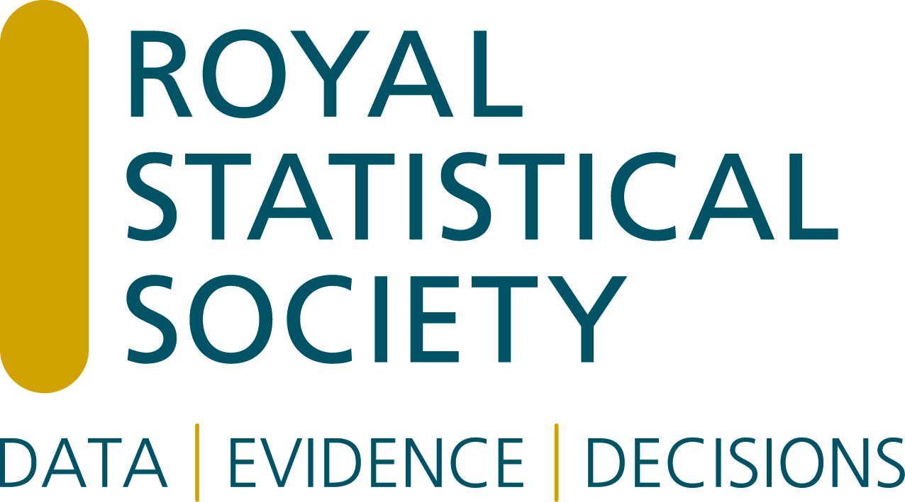

UK Conference On Teaching Statistics (UKCOTS) is for everyone with an interest in the teaching of statistics in higher education in whatever department or discipline. UKCOTS is supported by the Royal Statistical Society (RSS).

{fig-alt="RSS Logo" fig-align="center" width="30%"}

While the primary intended audience is statistics educators working in higher education, the conference is open to all, including those interested in pre-18 statistics education, or in professional training.

We are happy to announce that the next UKCOTS will be held in London in 2027, with more details below.

## UKCOTS 2027 - Save the Date!

We are delighted to announce that UKCOTS 2027 will take place on 16-18 June 2027 at Imperial College London, jointly organised with UCL. Mark your calendars – we look forward to welcoming you to London.

## Teaching Statistics UKCOTS special edition

We are delighted to announce that a [Teaching Statistics](https://onlinelibrary.wiley.com/journal/14679639){target="_blank"} special edition for UKCOTS24 will be published in the near future. More information to follow!

## Keep in touch

- Sign up to the UKCOTS mailing list at <https://www.jiscmail.ac.uk/ukcots> (click *Subscribe or Unsubscribe* under *Options*). We won't spam: only information relevant to UKCOTS and other COTS events will be sent. Information about the next UKCOTS will be sent through this channel, as will alerts about major changes to the UKCOTS website.

- Sign up to the Burwalls mailing list at <https://www.jiscmail.ac.uk/burwalls>.

- Sign up to the RSS Teaching Statistics newsletter at [RSS Teaching Statistics section homepage](https://rss.org.uk/membership/rss-groups-and-committees/sections/teaching-statistics/){target="_blank"}.

- Follow UKCOTS on [Bluesky](https://bsky.app/profile/ukcots.bsky.social).

- Follow the RSS Teaching Statistics Section on [X/Twitter](https://twitter.com/rss_teach){target="_blank"}.

- Follow the RSS Teaching Statistics Section on [LinkedIn](https://www.linkedin.com/company/rss-teaching-statistics-section){target="_blank"}.

- If you have any questions about the conference, please contact us at [conference\@ukcots.org](mailto:conference@ukcots.org){.email}
